##### Imperial College London, Department of Electrical & Electronic Engineering


#### ELEC70142 Digital VLSI Design

### Lab 2 - Understanding and Editing Layout

##### *Peter Cheung, v2.1 - 11 September 2026*

---
### Objectives
---
By the end of this laboratory session, you should be able to do the following.
* Understand the different mask layers that make up the layout of an inverter.
* Manually extract the circuit schematic of a 12-transistors logic gate from its layout.
* Import a Verilog netlist into Custom Compiler as a schematic.
* Use Synopsys's Custom Compiler tool to perform manual floorplanning and placement.
* Use Synopsys's Custom Compiler tool to perform manual routing.
* Import a GDSII layout and a CDL netlist into Custom Compiler.
* Use Siemens's Calibre tool to find and fix design rule violations through DRC.
* Use Siemens's Calibre tool to verify that a layout is the same as its netlist through LVS.

>Due to the length of this laboratory experiment, Lab 2 is now divided into Part 1 and Part 2:  
>* Part 1 (Tasks 1 & 2) is about understanding the layout of a VLSI circuit. 
>* Part 2 (Tasks 3 to 5) is about using Synopsys's Custom Compiler layout editor to create, modify and repair a layout.


---
### Task 1 - Deep Dive into Inverter Layout (30 min)
---
The purpose of this task is to understand the different mask layers that make up a simple inverter from the layout.  This helps you to appreciate the fabrication process and the physical aspect of VLSI design.

**_Step 1: Launch Custom Compiler_**

Log onto the teaching server ee-mill1 or ee-mill2 (depending on your group number), and set up the technology with **_vlsi-tooling/syn tsmc65LP_** as before.

Make a new folder for Lab 2 and launch Custom Compiler:
```bash
cd ~/Labs
mkdir Lab_2
cd Lab_2
custom &
```
A Custom Compiler window will appear. You are now running the Synopsys Custom Compiler package in the background.

**_Step 2: Fetch the inverter standard cell from library_**

Go to the Custom Compiler window and click **_Tools -> Library Manager ..._**.  
<p align="center"> 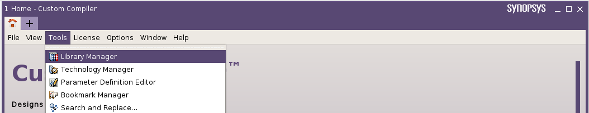 </p><BR>

Select TSMC's **_tcbn65lpbwp7t_9lm_** library.

>**TSMC process library naming convention:** 
> * **_tc_** - technology characterisation
> * **_bn65_** - 65nm standard cell library
> * **_lp_** - low power option
> * **_bwp7t_** - bulk CMOS (bw), low threshold voltage (p) and 7-track height
> * **_9lm_** - 9 layers of metal

<p align="center"> 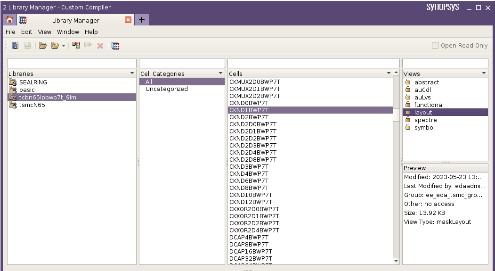 </p><BR>

**_Step 3: Examine mask layers for the inverter_**

From the list of standard cells in this technology library will appear. Select **_CKND1BWP7T_**.  This is one of the cells used in the LFSR4 netlist from the physical synthesis flow from Lab 1.

>**TSMC standard cell naming convention:** 

> * **_CKN_** - clock inverter cell
> * **_D1_** - 2nd lowest output current capability (D6 is highest)
> * **_BWP7T_** - bulk CMOS (bw), low threshold voltage (p) and 7-track high cell library (7t)

Double click the **_layout_** view on the right most pane to view the layout of this inverter standard cell.  (See diagram above.) You can also use the shortcut command **_"f"_** to fit the entire layout in the window.

Examine the different mask layers that make up this inverter by doing the following:
1. The layout cellview window shows the inverter standard cell layout. On the right are ALL the mask layers associated with this fabrication process. There are more than 50 masks included!  Examine them briefly and see if you can spot some of them that you can recognise.
2. Click on **_Design_** under LPPs to show ONLY the masks layers that are used in this design.  (See diagram below.)
3. In the top right, uncheck the "Valid" check box next to "Visible" to turn OFF all layers
4. From top to bottom, turn on one layer at a time, by clicking on the name, and observe how the inverter cell is "constructed".
   
Discuss with your partner what you understand from this exercise.

<p align="center"> 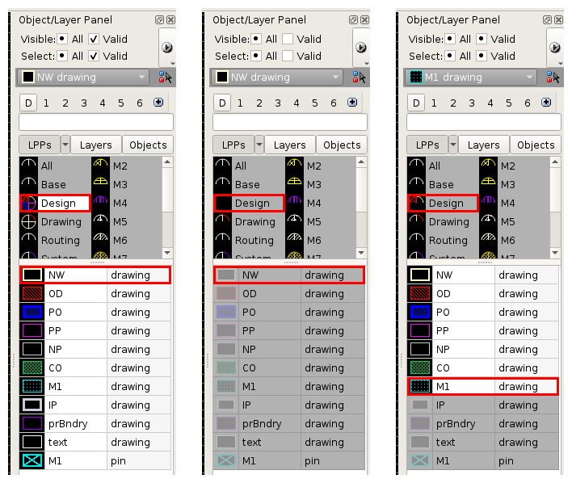 </p><BR>

> **Name of the mask layers:**
> * NW - N-well
> * OD - oxide diffusion region, also called Active mask
> * PO - polysilicon gate
> * PP - p-type diffusion
> * NP - n-type diffusion
> * CO - contact
> * M1 - metal 1 
> * prBndry - boundary of the standard cell where it is joint to the next cell
> * text - text label for this cell (i.e. cell name)
> * M1 - cell input output pin locations on metal 1


### Task 2 - Extract Circuit from Layout (40 min)

The goal of this task is for you to learn how to interpret a layout and re-create the transistor schematic of a 12-transistors standard cell.

**_Step 1: Load the XOR gate standard cell_**

If the Library Manager window is not open, open it from the Custom Compiler home window with: **_Tools -> Library Manager ..._**.

In the Library Manager window, select the XOR gate standard cell **_XOR2D0BWP7T_**.

Open the layout of this standard cell by double-clicking on **_layout_** view.  Use the **_"f"_** command to fit the layout within the window.

**_Step 2: Extract the circuit schematic from the layout_**

You and your lab partner are now required to extract from this layout all the transistors. Then connect them together to produce a transistor level schematic diagram.  You should label all top row transistors from left to right with **_odd_** designations (i.e. T1 to T11), and the bottom row transistors with **_even_** designations (T2 to T12).  Put the schematic circuit diagram in your logbook and record what you have learned.

**_Step 3: Sizing the transistors_**

* With the  **_"k"_** command, measure the **sizes** (i.e. widths and length) of all transistors and annotate them on your schematic.
* Check with another group near you whether you have the same circuit as they do.  
* Satisfy yourself that this circuit fulfils the logic function of a 2-input XOR gate.

> You can remove the measurement and ruler annotations with the **_SHIFT-k_** command.

### Task 3 - Hand Place the standard cells (45 min)

The purpose of this task is for you to learn how to use Custom Compiler for **layout editing**.  While you will not be designing layout of a gate from transistor up, you will still need to learn how to wire up synthesized modules and to connect them to the pad ring.

The goal of this task is for you to import the cells used in the LFSR4 Verilog netlist from Lab 1 and manually place them in a row of cells in an optimal order.

**_Step 1: Create the Lab_2 library_**

Before we start layout editing we need to create a project, called a **_library_**.

In the Library Manager, use **_File -> New -> Library ..._** and fill in the dialogue box:

*   **_Name_**: `Lab_2`
*   **_Directory_**: `./`
*   **_Type_**: `OpenAccess (FileSys)`
*   Under **_Technology_**, select the **_Tech Library_** radio button and pick **_tsmcN65_** from its dropdown.

Click **OK**.

<p align="center"> 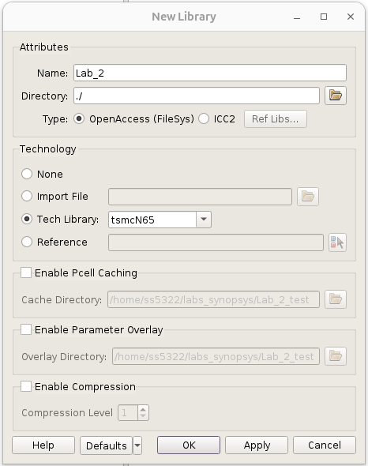 </p><BR>

>This creates a library called `Lab_2` in your current working directory and attaches it to TSMC's 65nm technology library.  

Copy the placed-and-routed netlist for LFSR4 from Lab 1 into this directory:

```bash
cp ../Lab_1/outputs/fusion/lfsr4_layout.v ./Lab_2/
```

>If you ran Lab 1's logical flow rather than the fusion flow, your netlist is in `outputs/logical/` and will contain a different set of cells.  The rest of this lab assumes the fusion netlist.

**_Step 2: Import the synthesized LFSR4 circuit into Custom Compiler_**

In the Custom Compiler home window, use **_File -> Import -> Schematic from Netlist ..._**.  A dialogue box called **_"Generate Schematics from Text"_** will open.

<p align="center"> 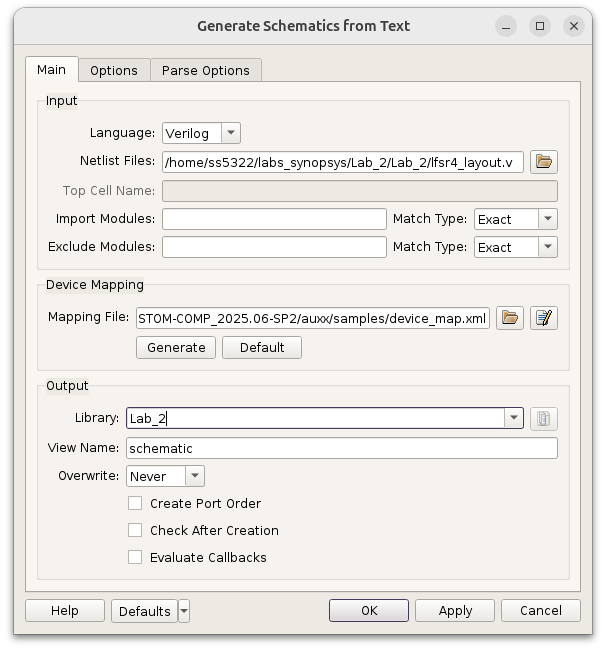 </p><BR>

Fill in three fields and leave every other setting at its default:
1. **_Main_** tab, **_Language_**: `Verilog`.  This is already the default.
2. **_Main_** tab, **_Netlist Files_**: browse to the `lfsr4_layout.v` you copied above.
3. **_Main_** tab, **_Library_** (under Output): `Lab_2`.

Click **OK**.

Open **_Tools -> Library Manager_**, then double click **_Lab_2 -> lfsr4 -> schematic_**.  Use the **_"f"_** shortcut to fit the entire schematic in the window.

<p align="center"> 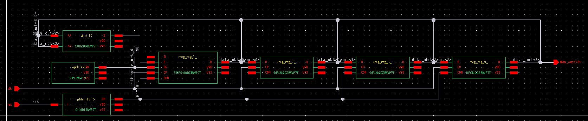 </p><BR>

>To navigate around the schematic, you can zoom in and out at the pointer location using the scroll wheel. You can press 3 to enter pan mode and then pan around the window by dragging the mouse and holding the left mouse button. Press ESC to leave pan mode.

Zoom into one of the flip-flops, say `sreg_reg_4_`.  All the signal connections are wired automatically, but the **VDD** and **VSS** pins are left dangling.  This is because a Verilog netlist describes logic only.

<p align="center"> 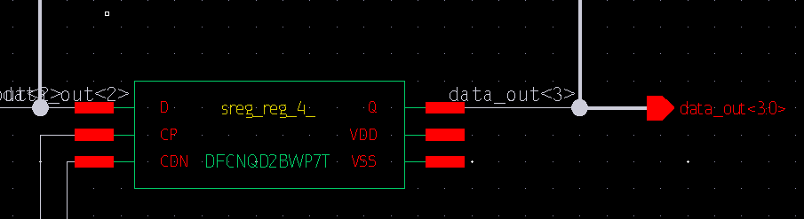 </p><BR>

**_Step 3: Add VDD and VSS connections to the schematic_**

We now need to tell the schematic about the VDD and VSS connections.
* Use the **_"w"_** command (**_Add -> Wire_**) and draw two horizontal wires, one from the VDD pin and one from the VSS pin.  Press ESC to terminate each wire.
* Use the **_"l"_** command (**_Add -> Wire Name ..._**) and enter `VDD` as the name, then click the wire to be named.  Do the same for `VSS`.
* Repeat this on all seven components.

>A quicker way is to select the two wires and their names, copy them with **_"c"_**, and click at a new location to paste.  If you make a mistake, **_"u"_** undoes the previous action.

Once all seven components have their VDD and VSS wires, run **_Check and Save_**. in the top left.

>We know the circuit represented by the schematic is a faithful representation of the intended circuit, because it was generated from the netlist you simulated in Lab 1.

**_Step 4: Generate the layout from the schematic_**

We now need to create a layout view of the LFSR4 circuit as a companion to the schematic view.  Custom Compiler does this with **SDL** (Schematic Driven Layout).  SDL creates one layout instance for each schematic instance and carries across the connectivity, so the tool knows which pins should be joined.

1. In the layout window, tick **_Tools -> SDL_**.  A **_"Define Physical Target"_** dialogue box opens.
2. Set the **_Layout Cellview_** to Library `Lab_2`, Cell `lfsr4`, View `layout`.  Leave **_Specify Config Cellview_** ticked with view `layout.config`.

<p align="center"> 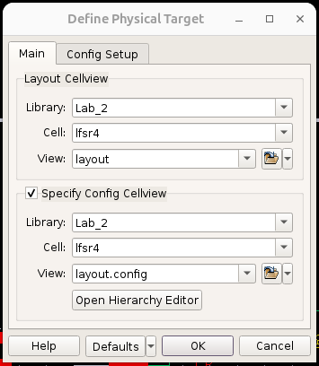 </p><BR>

3. Click **_Open Hierarchy Editor_** and move `abstract` to the **end** of both lists, so they read:

```
View Search List:  layout schematic abstract
View Stop List:    layout abstract
```
Save the config and close the Hierarchy Editor, then click **OK**.

4. Now generate the layout with **_SDL -> Generate Layout ..._**.

<p align="center"> 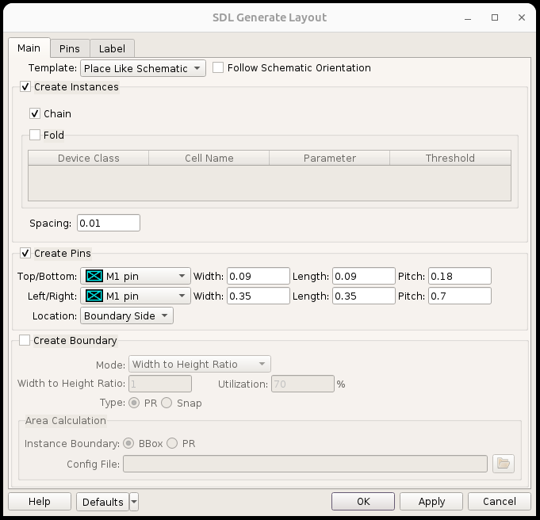 </p><BR>

5. On the **_Main_** tab, set both **_Top/Bottom_** and **_Left/Right_** under **_Create Pins_** to **_M1 pin_**.
6. Untick **_Create Boundary_**.  You will draw the place and route boundary yourself in the next step.
7. On the **_Label_** tab, tick **_From: Pin_**, **_LPP: Pin_**, leave the dropdown on **_Specify_**, and set the layer to **_M1 pin_**.

<p align="center"> 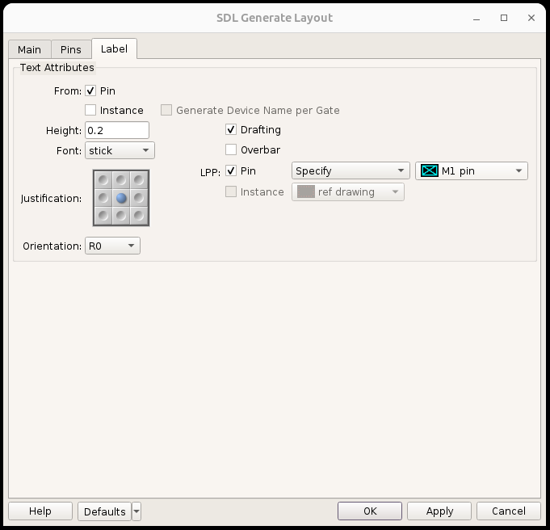 </p><BR>

8. Click **OK**.  All seven standard cell instances appear on the layout canvas, arranged roughly as they were in the schematic.
9. Press **_SHIFT-f_** to expand the hierarchy and show the mask layers inside each cell.  

**_Step 5: Floorplanning_**

The goal of this step is to arrange the cells into a rough floorplan as shown below, so that output pins end up close to the input pins they drive.

<p align="center"> 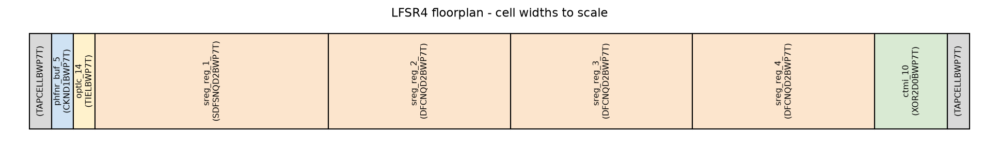 </p><BR>

>The two grey **_TAPCELLBWP7T_** cells at the ends of the row are not in your layout yet, they will be added later.

Before we can move the cells to match this floorplan, we need to do three preliminary steps:

1. **Arrange the schematic and layout windows side by side.**  The layout window should be the wider of the two.  Selecting a cell in one window highlights it in the other.  In this way you can identify the four flip-flops.
2. **Create the place and route boundary.**  Use **_Create -> Boundary_** and drag out a rough rectangle with the cursor.  Then select it, press **_"q"_** to open its properties, and set the corners points list to `(0 0)`, `(0 5)`, `(30 0)`and `(30 5)`. Press the green tick in the properties tab to apply changes.
3. **Check the snap grid.**  Open **_Options -> Design_** and look at the **_Snapping & Grids_** tab.  Snap Grid Spacing should read `0.005` in both X and Y.

<p align="center"> 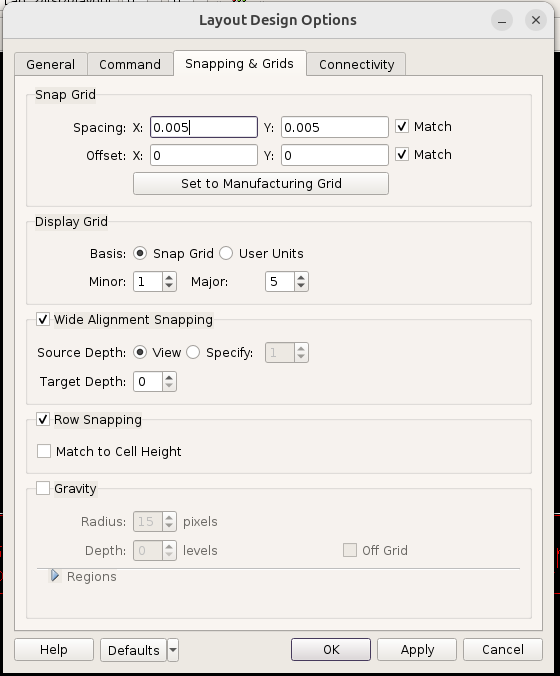 </p><BR>

Now select one cell at a time and drag it into the boundary, in the order shown in the floorplan diagram.  Do not worry about precision yet.  Step 6 does the exact placement.

>You can only move a component horizontally or vertically in one step, not diagonally.

The result should look something like this: 
<p align="center"> 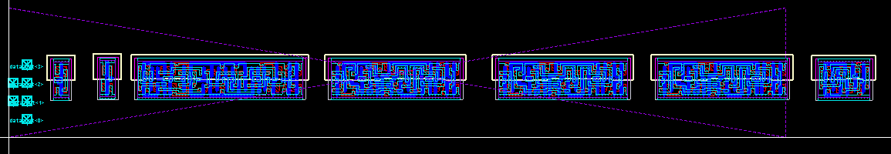 </p><BR>

**_Step 6: Manual Placement_**

The next step is to place each cell at its **_final precise location_**.  This needs to be exact, and you will have to zoom well in with the scroll wheel so that all the geometry is clearly visible.

The command you need is **_Edit -> Arrange -> Align_**, shortcut **_"4"_**.  You pick a source edge and then a target edge, and the selected object moves to line up with the target.  Place the left-most cell abutting its right-hand neighbour:

1. Zoom into the top right corner of the left-most cell.
2. Select that cell.  It is highlighted with a **WHITE** bounding box.
3. Press **_"4"_**.  The cursor now has an alignment icon attached to it.  You are now in **_alignment mode_**.
4. Click the **_bottom edge_** of the metal 1 VDD wire of the selected cell.  This is the source.
5. Click the bottom edge of the metal 1 VDD wire of its neighbour.  This is the target, and the two cells are now aligned **_vertically_**.
6. Select the cell again and press **_"4"_**.  This time click the thin vertical purple line on the right of the selected cell.  That line marks the place and route boundary of the cell for abutment.
7. Click the purple line on the left of its neighbour.  The two cells now abut exactly.

You have now successfully placed two cells together.

>You can move cells closer together by dragging a rectangular box around several of them to select the group and moving them together.  That lets you get two cells into the same window before aligning them.

Repeat this for all the cells to form a perfectly aligned and abutted row of standard cells.

> Beware that cell boundaries must align **EXACTLY**.  You can zoom and pan freely in the middle of an alignment operation.

<p align="center"> 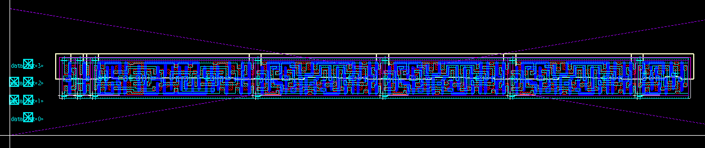 </p><BR>

Before we finish this placement step, we need to add a **tap cell** to each end of the row.  A tap cell connects the n-well (for the p-type transistors) to the VDD rail and the p-well (for the n-type transistors) to VSS.  Tap cells carry no logic, so they do not appear in a Verilog netlist and were not inserted by the step that generated this layout.  In Lab 1 you had Fusion Compiler place them automatically with **_create_tap_cells_**; here you are doing it by hand.

Use **_Create -> Instance_**, shortcut **_"i"_**, to open the **_Create Instance_** dialogue box:

* **_Library_**: `tcbn65lpbwp7t_9lm`
* **_Cell_**: `TAPCELLBWP7T`
* **_View_**: `layout`

<p align="center"> 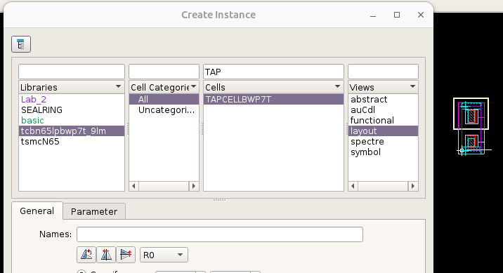 </p><BR>

Place one tap cell at each end of the row and align them with **_"4"_** exactly as you did for the standard cells.

**_Step 7: Design Rule Check (DRC) on the Placement_**

To make sure that your placement has not violated any design rules (e.g. a cell misaligned against its neighbour), we now run a design rule check on the layout so far.  DRC is done by **_Calibre_**, a Siemens tool which is driven from inside Custom Compiler.

First we need to make the Calibre menu available.  In the layout window, tick **_Tools -> Calibre_** and a **_Calibre_** menu will appear in the menu bar.


1. Use **_Calibre -> Run nmDRC ..._**.  The **_Calibre Interactive - nmDRC_** window opens.
2. On the **_Rules_** page, set **_Rules File_** to:

```
/eda/cadence_tools/kits/tsmc/65n_LP/Calibre/drc/calibre_density_off.drc
```

3. On the **_Inputs_** page, check that **_Layout Format_** is `OPENACCESS`, **_OA Library Name_** is `Lab_2`, **_Top Cell_** is `lfsr4` and **_OA View Name_** is `layout`.  Custom Compiler fills these in from the window you launched from.
4. Click **_Run DRC_**.

<p align="center"> 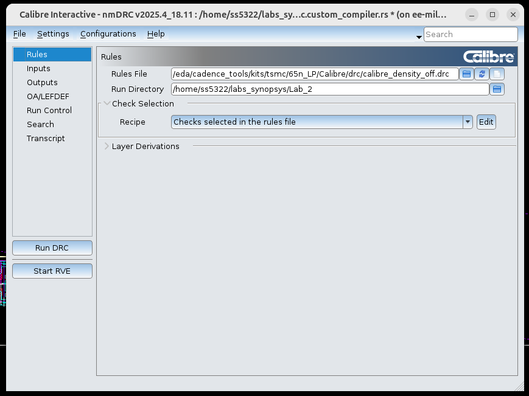 </p><BR>

When the run finishes the **_Calibre RVE_** window opens with the results.  Double clicking a check explains what it is highlights it on the layout.

A correct placement produces **no violations**.  You will see one result under `DRM.R.1` covering the whole block; read its description and you will find it is a reminder, telling the designer to check the related design rule manuals by hand.  It is not an error in your layout.

> If you do get real violations they will almost always sit on a cell boundary, and the cause is two cells that are not exactly abutted, or whose power rails are not aligned.  Go back to Step 6 and re-align them.

### Task 4 - Hand Route the standard cells (30 min)

The next task is to connect all these cells according to the following wiring diagram.

>Hand routing the whole circuit to a clean DRC takes far longer than one lab session.  We recommend that you route **one** connection in Step 2, run DRC, and then move on to Task 5.  Steps 3 to 6 describe the rest of the routing for anyone who wants to complete it in their own time.

<p align="center"> 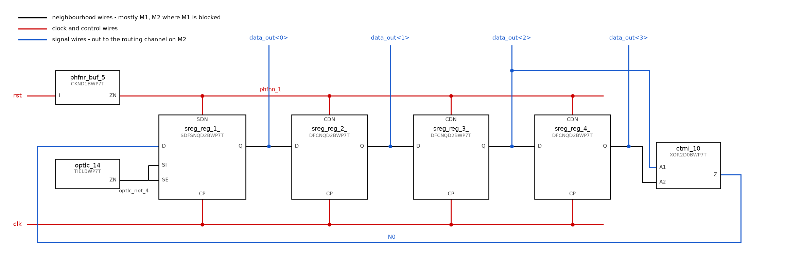 </p><BR>

There are three types of connection:

1. **Neighbourhood wires** (black) - from the output on one cell's right boundary to the input on the next cell's left boundary.  There are five: the tie cell into `SI` and `SE`, the three shift-chain links from `Q` to the next `D`, and `data_out<3>` into the XOR's `A2`. 
2. **Clock and control wires** (red) - `clk` to the four `CP` pins, and `phfnn_1` from the inverter to `sreg_reg_1_.SDN` and the three `CDN` pins.  Each is one long horizontal wire in a routing channel, with a short drop into every cell it feeds.  In Lab 1 the tool did this for you, and clock tree synthesis ran before routing.
3. **Signal wires** (blue) - internal signals between cells that are not adjacent, so they must leave the row and travel through a routing channel on metal 2 (M2).  There are two: `data_out<2>` back to the XOR's `A1`, and `N0` from the XOR output all the way back to `sreg_reg_1_.D`.  The four `data_out` output ports belong in this group as well.

Before you start, discuss the wiring strategy with your lab partner, and make sure you know which design rules you have to obey.  The exact TSMC rules are proprietary and cannot be reproduced here.  The table below was generated with the help of ChatGPT and is in the public domain; it is a guideline only, for educational purposes.  The real rules are in the documentation section of the PDK.

>Those highlighted in green are the ones relevant to hand routing.

<p align="center"> 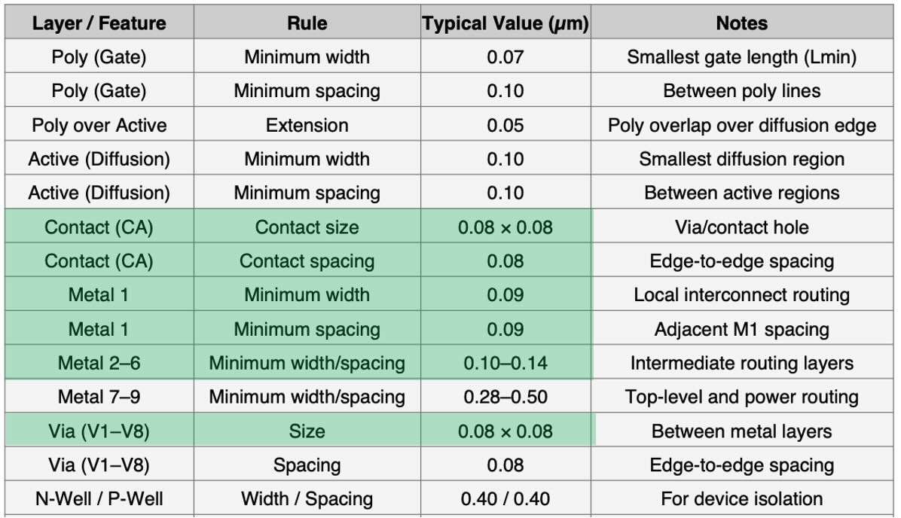 </p><BR>

**_Step 1: Practise layout editing for wiring_**

Manually connecting a circuit is tedious and mistakes are easily made. However, it is also a vital skill to learn in full-custom VLSI design. Before you wire up the circuit, this step helps you learn how to create wires of certain dimension and check for DRC violations each step of the way.

Work in an empty area of the canvas, away from the row of cells.

1. In the **_Object/Layer Panel_** on the right, click **_M1 drawing_** to make it the active layer.
2. Press **_"r"_** (**_Create -> Rectangle_**) and drag out a rectangle of any size.
3. Select it and press **_"q"_** to open its properties.  Set the height to `0.1` and the width to `0.5`.  Units are microns.
4. Click **_M2 drawing_** in the layer panel and draw a **vertical** M2 rectangle `0.1` wide by `0.3` high, overlapping one of the M1 rectangles.  Together these represent a signal leaving a standard cell on M1 and heading into the routing channel on M2.
5. Select the M2 rectangle and press **_"o"_** (**_Create -> Via_**).  A **_Create Via_** dialogue appears.  **Tick the _Auto_ mode box** - it is off by default.
6. Click on the overlap between the M1 and M2 rectangles.  Auto mode fills the shared area with as many vias as will legally fit.

You have now successfully connected a vertical M2 wire to a horizontal M1 wire.

<p align="center"> 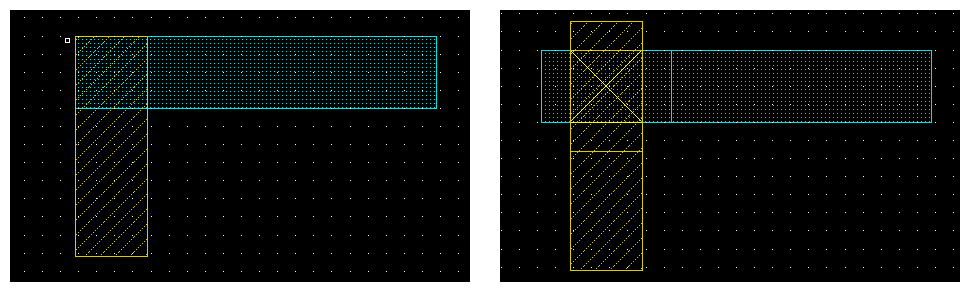 </p><BR>


**_Step 2: Route one neighbourhood wire_**

Both pins are on M1, on cells that abut, so these are the shortest connections in the design.  There are five:

| From | To |
|---|---|
| `optlc_14.ZN` | `sreg_reg_1_.SI` and `.SE` |
| `sreg_reg_1_.Q` | `sreg_reg_2_.D` |
| `sreg_reg_2_.Q` | `sreg_reg_3_.D` |
| `sreg_reg_3_.Q` | `sreg_reg_4_.D` |
| `sreg_reg_4_.Q` | `ctmi_10.A2` |

Pick one to route.  We suggest `sreg_reg_1_.Q` to `sreg_reg_2_.D`.

The cells are already full of their own M1, so you will not always find a clear M1 path between the two pins.  Where the direct route is blocked, we bridge over it on M2:

* Draw a short M1 stub off each pin, up to the blockage on either side.
* Select **_M2 drawing_** and draw an M2 rectangle spanning the gap, overlapping the end of both M1 stubs.
* Add an M1-M2 via at each of the two overlaps with **_"o"_** in Auto mode.
* Keep the M2 at least the minimum M2 width and spacing.


Run **_Calibre -> Run nmDRC_**.  It should be clean apart from the `DRM.R.1` reminder.  That is all Task 5 needs, so continue there, or carry on to Step 3 to complete the routing.

**_Step 3 (optional): Routing the clock_**

`clk` has to reach the `CP` pin of all four flip-flops.  Those pins are inside the row, so this needs both metal layers.

* Draw a horizontal **M1** wire for the clock in the routing channel **below** the row of cells.  Make it at least minimum width, and keep at least minimum spacing from the VSS rail along the bottom of the row.
* For each flip-flop, place an **M2** rectangle over its `CP` pin, covering the M1 pin metal.
* Add M1-M2 vias at each `CP` pin with the **_"o"_** command in Auto mode.
* Extend each M2 rectangle down to the horizontal M1 clock wire.
* Add M1-M2 vias where each M2 stub meets the clock wire.
* Run DRC.


**_Step 4 (optional): Routing the reset_**

`phfnn_1` runs from `phfnr_buf_5.ZN` to `sreg_reg_1_.SDN` and to `CDN` on the other three flip-flops. Do this in the channel **above** the row.

* Draw a horizontal M1 wire for `phfnn_1` in the channel above the row.
* Connect `phfnr_buf_5.ZN` up to it.
* Drop M2 onto each `SDN` and `CDN` pin, add vias, and run each up to the horizontal wire, adding vias where they meet.
* `rst` itself only has to reach `phfnr_buf_5.I`, which is a short wire.
* Run DRC.

**_Step 5 (optional): The internal signal wires_**

We have two connections left, and both have to travel through a routing channel:

* **`data_out<2>` to `ctmi_10.A1`.**  Tap the wire you already made between `sreg_reg_3_.Q` and `sreg_reg_4_.D`, take it out of the row on M2, run it along a channel, and bring it back down into `A1`.
* **`N0`, from `ctmi_10.Z` to `sreg_reg_1_.D`.**  This one crosses the entire block.  Route it in whichever channel has room, remembering that the clock wire is below and the reset wire above, and that you must keep minimum spacing from both.

Run DRC after each of them.

**_Step 6 (optional): Connect the pins_**

The block has **eight** ports.  Six of them - `clk`, `rst` and `data_out<3:0>` - already exist on the layout as M1 pins with labels, created when you generated the layout from the schematic in Task 3 Step 4.  The other two, `VDD` and `VSS`, do not exist yet and you have to make them.

First, position the six that are there:

* Find each pin and move it onto the wire carrying that signal.  A pin must physically **overlap** the M1 of its net.  
* Bring the four `data_out` pins out to the right hand end of the row, as the wiring diagram shows.

Then create the two power ports:

* The row has two horizontal M1 rails carrying VDD and VSS.  They exist because the cells abut, and nothing has ever named them.  The `VDD` and `VSS` labels you can see belong to the **standard cells' own layouts**, inside `tcbn65lpbwp7t_9lm`, not to `lfsr4`.
* Make **_M1 pin_** the active layer, use **_Create -> Text_**, and place a `VDD` label on one rail and a `VSS` label on the other.  

Run a final **_Calibre -> Run nmDRC_**.  It should be clean apart from the `DRM.R.1` reminder.

### Task 5 - Fixing a broken layout (60 min)

The purpose of this task is to learn how to read Calibre's DRC and LVS reports and use them to find and fix mistakes in a layout.  You are given a completed layout of LFSR4 that contains a number of deliberate errors, together with the netlist of the circuit it is supposed to implement.  Your job is to bring the layout to a clean DRC and a `CORRECT` LVS.

**_Step 1: Import the broken layout and its netlist_**

The two files are in the `broken_netlist` folder of this lab's repository.

First create a library to hold the broken design.  In the Library Manager, use **_File -> New -> Library ..._** and fill in the dialogue box exactly as you did in Task 3:

*   **_Name_**: `task_5`
*   **_Directory_**: `./`
*   **_Type_**: `OpenAccess (FileSys)`
*   Under **_Technology_**, select the **_Tech Library_** radio button and pick **_tsmcN65_** from its dropdown.

<p align="center"> 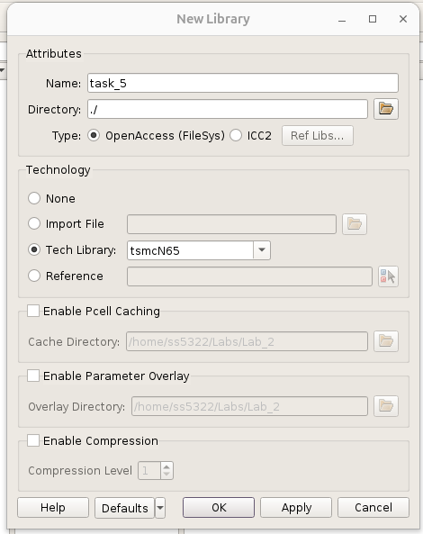 </p><BR>

Next import the netlist as a schematic.  In the Custom Compiler home window, use **_File -> Import -> Schematic from Netlist ..._** and fill in four fields, leaving every other setting at its default:

1. **_Language_**: `CDL`.
2. **_Netlist Files_**: browse to `broken_netlist/schematic.sp`.
3. **_Top Cell Name_**: `lfsr4`.
4. **_Library_** (under Output): `task_5`.

<p align="center"> 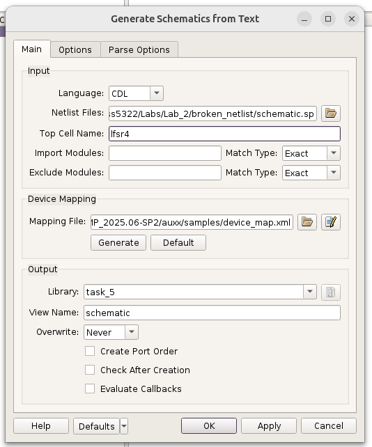 </p><BR>

Click **OK**, then open **_task_5 -> lfsr4 -> schematic_** from the Library Manager and check that the circuit is the LFSR4.

Finally import the layout.  Use **_File -> Import -> Stream_** and fill in the **_Main_** tab, leaving the other tabs at their defaults:

1. **_Stream File_**: `broken_netlist/netlist.gds`.
2. **_Top Cell_**: `lfsr4`.
3. **_Library_** (under Output): `task_5`, with **_View_** left as `layout`.
4. Under **_Technology_**, select **_Attach_** and pick **_tsmcN65_**.

<p align="center"> 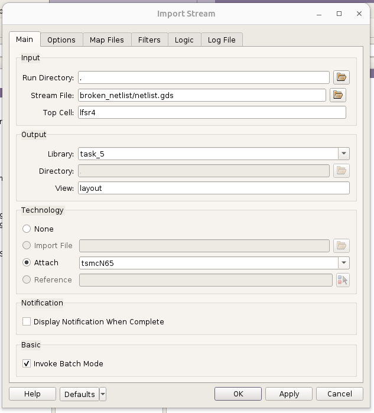 </p><BR>

Click **OK**.  The library `task_5` now holds a schematic and a layout of `lfsr4`, just as `Lab_2` did at the end of Task 4.

**_Step 2: Run DRC_**

Open **_task_5 -> lfsr4 -> layout_** and press **_SHIFT-f_** to show the mask layers inside each cell.  The layout is the LFSR4 row you placed in Task 3, fully routed, with its pins in place.

<p align="center"> 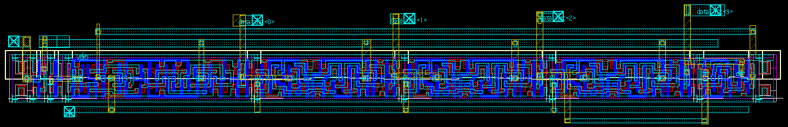 </p><BR>

Run a design rule check on it, exactly as in Task 3 Step 7.  Tick **_Tools -> Calibre_** if the **_Calibre_** menu is not already there, then:

1. Use **_Calibre -> Run nmDRC ..._**.
2. On the **_Rules_** page, set **_Rules File_** to:

```
/eda/cadence_tools/kits/tsmc/65n_LP/Calibre/drc/calibre_density_off.drc
```

3. On the **_Inputs_** page, check that **_OA Library Name_** is `task_5`, **_Top Cell_** is `lfsr4` and **_OA View Name_** is `layout`.
4. Click **_Run DRC_**.

**_Step 3: Fix the DRC violations_**

When the run finishes the **_Calibre RVE_** window opens.  Alongside the `DRM.R.1` reminder, you will find three other checks with results.  Click a check in the left hand pane and the description box at the bottom explains the rule it tests.  The numbers to the right of it are the individual violations of that rule.  Double click one and switch to the layout window: the offending shapes are highlighted, and you may need to zoom out to find them.

Now fix them.  Everything you need is in Task 4: moving a shape, changing its dimensions with **_"q"_**, adding or deleting a via with **_"o"_**.  Think about what each rule is protecting before you move anything.

>Fix one violation at a time and re-run DRC after each.  A fix that moves a wire can easily create a new violation somewhere else.

Run a final **_Calibre -> Run nmDRC_**.  It should be clean apart from the `DRM.R.1` reminder.

**_Step 4: Perform Layout vs Schematic (LVS) check_**

A clean DRC means the layout can be manufactured.  It does not mean the layout is the right circuit.  LVS extracts a netlist from the layout and compares it against the reference netlist, device by device and net by net.

1. In the layout window, use **_Calibre -> Run nmLVS ..._**.
2. On the **_Rules_** page, set **_Rules File_** to:

```
/eda/cadence_tools/kits/tsmc/65n_LP/Calibre/lvs/calibre.lvs
```

3. On the **_Inputs_** page, check that **_Layout Path_** reads Library `task_5`, Top Cell `lfsr4`, View `layout`.  Then on the **_Netlist_** tab, **untick** **_Export from source viewer_**, enter `broken_netlist/schematic.sp` under **_Files_**, leave **_Format_** as `SPICE`, and check that **_Top Cell_** is `lfsr4`.


4. On the **_OA/LEFDEF_** page, under **_Read Options_**, tick **_Read Net Names as Text_** and **_Read Pin Names as Text_**.  Then open **_Mapping Files_**, tick **_Use Layer Map Files_**, and enter:

```
/eda/cadence_tools/kits/tsmc/65n_LP/tsmcN65/tsmcN65.layermap
```

5. The Database page is hidden by default.  Turn it on with **_Settings -> Show Pages -> Database_**.
6. On the **_Database_** page, tick **_Additional SPICE Files_** and add:

```
/eda/cadence_tools/kits/tsmc/beLibs/65nm_tmp/TSMCHOME/digital/Back_End/spice/tcbn65lpbwp7t_141a/tcbn65lpbwp7t_141a.spi
```

7. Click **_Run LVS_**.


The report will say `INCORRECT`.  That is expected.  The layout contains two errors that DRC cannot see, because a layout can obey every design rule and still be the wrong circuit.

**_Step 5: Fix the LVS discrepancies_**

In the **_Calibre RVE_** window, expand **_Comparison Results_** and then **_Discrepancies_**.  Click a discrepancy and the pane below describes it.

The first discrepancy is a missing port.  The source has a `VSS` port and the layout does not.

* The row has two horizontal M1 rails carrying VDD and VSS.  They exist because the cells abut.  The `VDD` and `VSS` labels you can see belong to the **standard cells' own layouts**, inside `tcbn65lpbwp7t_9lm`, not to `lfsr4`.  The `VSS` rail has no label of its own at the top level.
* Make **_M1 pin_** the active layer, use **_Create -> Text_**, and place a `VSS` label on the VSS rail.

The second discrepancy is a net that does not match its counterpart in the source.  Double click the net names in the description pane and the layout window highlights them.  Compare what is highlighted with the wiring diagram in Task 4.  How do you think this can be fixed?

>After every change, run DRC before you run LVS again, so that the fix has not introduced a design rule violation of its own.

Run **_Calibre -> Run nmLVS_** again and look for the banner near the top of the report:

```

                         #       ###################       _   _   
                        #        #                 #       *   *   
                   #   #         #     CORRECT     #         |     
                    # #          #                 #       \___/  
                     #           ###################               

```

`CORRECT` means the layout implements the netlist exactly.  If you still get `INCORRECT`, go back to the discrepancies in the RVE window and work through them one at a time.

You have now completed the full custom layout flow for LFSR4 and repaired a layout using the two checks every chip must pass before tapeout.  Since the layout matches the netlist, which came from the Lab 1 netlist you verified by simulation, we are confident that this LFSR4 layout works as intended.
